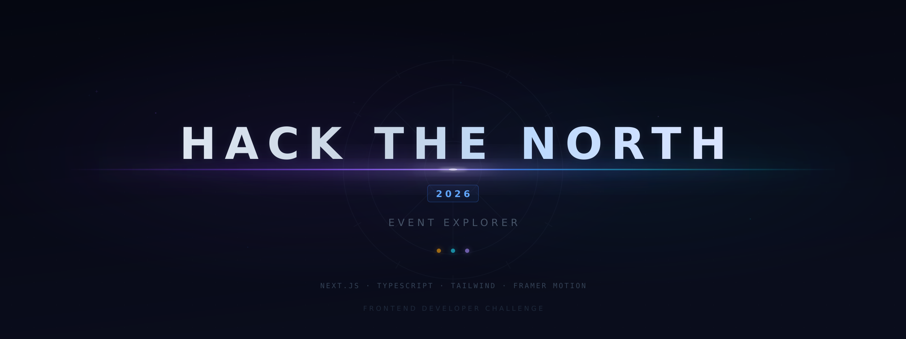

# 🎟️ Hack the North 2026 Frontend Challenge (Scroll to 'Part 2' for Writeup)
<p align="center">
  
</p>
A cinematic, planning-friendly event browser built for the pace of a hackathon weekend — fast to browse, easy to schedule, and resilient to messy real-world data.

Built with **Next.js 16 (App Router)**, **React 19**, **TypeScript**, **Tailwind CSS v4**, **TanStack Query v5**, and **Framer Motion**.

> **Live site:** https://htn-events-2026.vercel.app/
> **Demo login:** `hacker` / `htn2026`

---

## Why I built it this way

Hackathon schedules aren’t just “lists of events” — they’re something people rely on under pressure:
- phones at 2AM
- spotty Wi‑Fi
- last-minute room changes
- accessibility needs
- lots of quick decisions

So I optimized for:
- **Speed + clarity** (you always know what’s happening and when)
- **Planning UX** (grid for discovery, timeline for scheduling)
- **Maintainability** (a codebase a team can extend safely)
- **Accessibility** (keyboard + screen reader + reduced motion supported from the start)

---

## 🚀 Getting Started

```bash
npm install
npm run dev
````

Open [http://localhost:3000](http://localhost:3000)
Login credentials: `hacker` / `htn2026`

---

## 🧰 Tech Stack (and why)

| Layer             | Choice                  | Why it fits                                                                      |
| ----------------- | ----------------------- | -------------------------------------------------------------------------------- |
| **Framework**     | Next.js 16 (App Router) | Natural routing for `/`, `/login`, `/events/[id]` + great performance defaults   |
| **UI**            | React 19 + TypeScript 5 | Strict typing end-to-end and modern React patterns                               |
| **Styling**       | Tailwind CSS v4         | Fast iteration with consistent UI without CSS sprawl                             |
| **Data Fetching** | TanStack Query v5       | Caching + retries + clean loading/error states without fragile `useEffect` logic |
| **Animation**     | Framer Motion 12        | Smooth motion that still respects `prefers-reduced-motion`                       |
| **Icons**         | Lucide React            | Crisp, consistent, tree-shakeable icons                                          |
| **Dates**         | date-fns 4              | Lightweight date utilities with tree-shaking                                     |

---

## 🔎 What to look for

If you’re reviewing quickly, these are the “core quality signals” I focused on:

* **URL-synced filters & views** (refresh-proof + shareable links)
* **Dual view modes** (grid discovery + timeline scheduling)
* **Robust edge-case handling** (nullable fields, missing speaker photos, private related events)
* **Accessibility baked in** (skip link, semantics, focus states, reduced motion)
* **Config-driven event types** (`eventTypeConfig.ts` keeps UI consistent and scalable)
* **Config-driven brand fallbacks** (`brandVisuals.ts` centralizes sponsor logo matching + styling)

---

## 🗂️ Project Structure

```txt
src/
├── app/                          # Next.js App Router pages
│   ├── page.tsx                  # Home — hero + event listing
│   ├── login/page.tsx            # Login page
│   └── events/[id]/page.tsx      # Dynamic event detail
├── components/
│   ├── auth/LoginForm.tsx        # Auth form with validation + glow aesthetic
│   ├── events/
│   │   ├── EventCard.tsx         # Poster-style card with greyscale→color hover
│   │   ├── EventDetail.tsx       # Detailed event page (full API coverage)
│   │   ├── EventList.tsx         # Filtering, search, sort, dual view modes
│   │   ├── EventFilters.tsx      # Search bar, type chips, sort, view toggle
│   │   ├── ScheduleView.tsx      # Timeline grouped by day
│   │   ├── EventStats.tsx        # Metrics dashboard (counts, duration)
│   │   ├── AddToCalendar.tsx     # ICS export for calendar integration
│   │   ├── RelatedEventChip.tsx  # Linked related events
│   │   └── YouTubeEmbed.tsx      # Video embed for YouTube public URLs
│   ├── layout/
│   │   ├── Navbar.tsx            # Sticky nav + auth indicator
│   │   ├── Footer.tsx            # Minimal footer
│   │   └── PageContainer.tsx     # Content wrapper
│   └── ui/
│       ├── ErrorBoundary.tsx     # Graceful error recovery
│       └── Skeleton.tsx          # Loading placeholders
├── context/
│   ├── AuthContext.tsx           # useReducer + sessionStorage auth
│   ├── QueryProvider.tsx         # React Query config (5min stale, 1 retry)
│   └── MotionProvider.tsx        # MotionConfig reducedMotion="user"
├── hooks/
│   ├── useEvents.ts              # React Query wrappers (all events, by ID)
│   └── useDebounce.ts            # 300ms search debounce
└── lib/
    ├── types.ts                  # TEvent, TEventType, TSpeaker, TSortOption, TViewMode
    ├── api.ts                    # fetchAllEvents(), fetchEventById()
    ├── utils.ts                  # Date formatting, ICS generation, YouTube parsing
    ├── constants.ts              # API URL, auth creds, labels, storage keys
    └── eventTypeConfig.ts        # Icons, colors, gradients per event type
```

---

## ✅ Features

### Required (implemented)

* **All events rendered with full API field coverage** (every schema field is displayed)
* **Chronological sorting** by `start_time` by default + additional options (name, duration, type)
* **Authentication** gates private events behind login (**`sessionStorage`** persistence)
* **Related events** displayed as clickable chips linking to each event detail page

### Bonus (implemented)

* **Search** with 300ms debounce across event names
* **Type filtering** with count badges (Workshop, Tech Talk, Activity)
* **Persistent ordering via URL params** (filter/sort/search/view survive refresh + are shareable)

### Beyond the brief

* **Two view modes:** poster grid + timeline schedule (instant toggle)
* **Add to Calendar:** client-side `.ics` generation per event
* **YouTube embed:** detects YouTube URLs in `public_url` and renders inline player
* **Event stats dashboard:** totals, type breakdown, total hours
* **Speaker image fallbacks:** API image -> brand logo -> first-letter avatar -> type icon (no broken UI)
* **Skip-to-content link:** keyboard and screen reader friendly

---

# Part 2 — Writeup

## 1) Development Process

### How I planned it

Before writing code, I did two things:

1. **Read the requirements end-to-end** so the architecture wouldn’t fight the spec later
2. **Hit the API immediately** to understand the real data (nullable fields, speaker shape, and how `related_events` behaves)

From there, I built in intentional layers:

* **`lib/`**: pure logic only (types, API calls, utilities, constants, brand-visual rules). No React. Easy to test and refactor.
* **`hooks/`**: data layer abstractions (thin TanStack Query wrappers so UI doesn’t care about caching strategy).
* **`context/`**: cross-cutting state (auth with `useReducer`, avoiding prop drilling).
* **`components/`**: presentation, organized by domain so everything is discoverable.

This means you can trace any feature cleanly:
**route → page → component → hook → API → types**

### Why these tools

* **Next.js 16 (App Router):** The routes map perfectly to the problem (`/`, `/login`, `/events/[id]`). App Router keeps layout concerns clean and performance defaults strong.
* **TanStack Query v5:** Hackathon network conditions are unpredictable. Query provides caching, retries, and consistent loading/error states without race-condition-prone `useEffect` chains. I configured **5-minute stale time** and **1 retry** to balance freshness and stability.
* **Tailwind v4:** Fast iteration without style drift. Utility-first kept components readable and consistent.
* **Framer Motion:** Used for motion that supports comprehension (hover cues, transitions), with **reduced-motion support** enabled globally.

### Tradeoffs (intentional decisions)

* **`sessionStorage` auth:** Perfect for a demo challenge and keeps the auth logic simple/transparent. For production, I’d move to `httpOnly` cookies + real OAuth.
* **Client-side filtering/search:** Totally fine for the challenge’s scale. For 150+ events, I’d switch to indexed search (Algolia/Meilisearch/Fuse).
* **URL as the source of truth:** Slightly more work upfront, but it prevents state mismatch bugs and makes schedules shareable — a real UX win.

### Problems I encountered (and how I solved them)

**URL parameter synchronization (the hardest part)**
I needed search/filter/sort/view mode to persist across refresh *and* stay in sync with React state.
Solution: make the **URL the source of truth** using `useSearchParams()`. User actions update the URL; the UI derives state from it. This also made every configuration shareable (“here’s my schedule”).

**Greyscale-to-color hover effect without jank**
Coordinating image filters, overlay text readability, glow, and hover transforms required careful layering. Tailwind’s `group-hover` made it predictable and smooth.

**Related events referencing private events**
`related_events` can point to private events. Instead of broken links, I filter related event chips based on auth status so logged-out users only see events they can access.

### Areas I’m particularly proud of

**`eventTypeConfig.ts` as a single source of truth**
Every type’s visuals (icon, color, gradient) live in one typed config. TypeScript enforces completeness, so adding a new event type can’t silently break styling.

**Dual view system sharing one dataset**
Grid view is great for discovery; schedule view is great for planning. Both use the same filtered/sorted dataset so toggling is instant — no refetch, no reprocessing.

**Accessibility as architecture**
Semantic `<time>` elements, skip-to-content, focus-visible styles, ARIA labels for icon-only actions, and two-layer reduced motion support (MotionConfig + CSS). This wasn’t an afterthought — it’s part of the structure.

**Zero `any`**
Types everywhere: props, state, API responses, and utilities. It makes refactors safer and prevents “impossible states” from sneaking in.

---

## 2) If I had more time: making this a real product for thousands of users

If this were powering a live HTN weekend (thousands of hackers + public visitors), I’d prioritize **correctness under change**, **performance at scale**, and **operational readiness**.

### Real-time updates (top priority)

Schedules change. Rooms change. Events shift.
I’d add **Server-Sent Events or WebSockets** and push updates into TanStack Query via `queryClient.setQueryData()`.

### SSR/ISR for public events

Public browsing should be instant:

* server-render the public list (RSC/ISR)
* hydrate private-event visibility after login

### Search that scales

Client-side match works at 15 events — it won’t at 150+.
I’d move to:

* Algolia / Meilisearch, or
* a compiled Fuse.js index for fast client-side full-text search

### Personalization

* Favorites + “My Schedule”
* conflict detection (overlapping events)
* reminders/notifications for starred events
* calendar OAuth sync (instead of ICS download)

### Performance & stability

* virtualized lists (TanStack Virtual) for large schedules
* responsive images + CDN + `srcSet`
* edge caching strategies for global users
* bundle analysis + performance budgets

### Production authentication & roles

* OAuth / Auth.js / HTN auth system
* `httpOnly` cookies
* role-based access (hacker / mentor / organizer / sponsor)

### Observability

* error tracking (Sentry)
* Core Web Vitals monitoring
* analytics: what events get clicked, what filters matter, where users struggle

### “Live weekend” readiness

This is the difference between a cool app and a reliable event tool:

* feature flags for risky changes
* fast rollback path
* clear ownership/on-call plan during the weekend
* small PR cadence + predictable deploy workflow

---

## 3) Other thoughts

### On the challenge

This prompt is great because it’s small enough to ship thoughtfully, but realistic enough to surface real frontend skills: data edge cases, related-event graphs, and UX polish under constraints.

### On design philosophy

I leaned into a dark, cinematic vibe inspired by late-night hacking — but kept it content-first. The design is meant to help users scan quickly, recognize event types immediately, and build a plan without friction.

### Why Hack the North (Frontend Developer)

I’m excited about Hack the North because frontend work there isn’t “UI for UI’s sake” — it directly shapes how thousands of people experience the weekend. I care a lot about building interfaces that are:

* fast in real conditions
* inclusive and accessible
* maintainable for teams
* polished without being fragile

This project is my attempt to reflect those values in both the product experience and the codebase behind it.

---

## 🧩 Architecture Diagram

```txt
┌─────────────────────────────────────────────┐
│               Next.js App Router            │
│  ┌─────────┐  ┌──────────┐  ┌────────────┐  │
│  │   /     │  │  /login   │  │ /events/[id]│ │
│  └────┬────┘  └────┬──────┘  └────┬───────┘  │
│       │            │              │          │
│  ┌────▼────────────▼──────────────▼───────┐  │
│  │               Components               │  │
│  │ EventList · EventCard · EventDetail    │  │
│  │ LoginForm · Navbar · ScheduleView      │  │
│  └────┬────────────┬──────────────────────┘  │
│       │            │                         │
│  ┌────▼─────┐  ┌───▼────────┐               │
│  │  Hooks   │  │  Context    │               │
│  │ useEvents│  │ AuthProvider│               │
│  │ useDebounce│ │QueryProvider│              │
│  └────┬─────┘  └───┬────────┘               │
│       │            │                         │
│  ┌────▼────────────▼──────────────────────┐  │
│  │             lib/ (pure logic)          │  │
│  │ types · api · utils · constants        │  │
│  │ eventTypeConfig                        │  │
│  └──────────────────┬─────────────────────┘  │
└─────────────────────┼────────────────────────┘
                      │
           ┌──────────▼──────────┐
           │      HTN API v3     │
           │ /events · /events/:id│
           └─────────────────────┘
```
